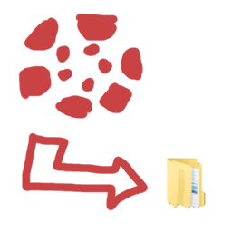
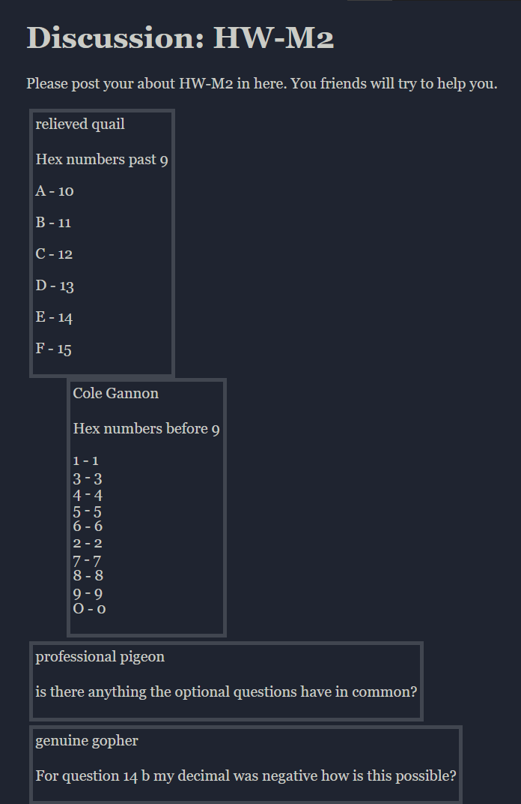

# archive-canvas-discussion



*Saving canvas discussion forums as JSON and HTML!*

*It's really not actually that exciting :(*



## usage

1. `npm i -D coarchive/archive-canvas-discussion`.
   Do not install globally on Windows! It just doesn't work for some reason.
2. Optionally, grab yourself a copy of [style.css](src/style.css) and stick it
   somewhere. This is what you can use instead of the builtin stylesheet.
3. Make a bookmarklet with [this file's content](bin/bookmarklet.min.js) as the url.
4. Go to the discussion forum page you want to archive and click it.
5. Copy that JSON output.
6. `archive-canvas-discussion`
7. Respond to the prompt.

```
What is the name of this discussion forum?
> hw-m2
Make sure the JSON is on your clipboard.
Then press enter when done...

Wrote df/hw-m2.json
Wrote df/hw-m2.html
Bye.
```

Options can be given through command line arguments to skip the prompt. In the above example, `--stylesheet`, `--dir`, and `--exclude` have already been provided.

- `--stylesheet:<path>`
- `--dir:<path>`
- `--name:<name>`
- `--exclude:<name,name>`
